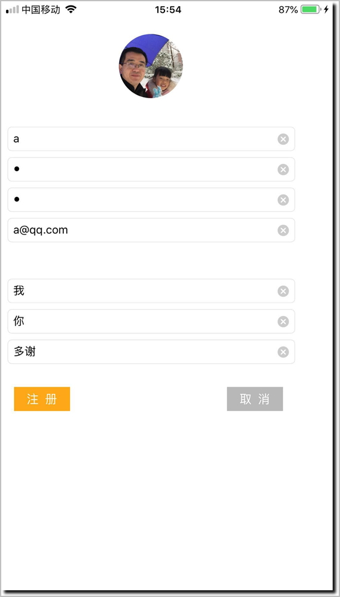

# 第6章 提交用户注册信息到LeanCloud


- 核心代码
```swift
let user = LCUser() //AVUser()
user.username = LCString(usernameTxt.text!.lowercased())
user.email = LCString(emailTxt.text!.lowercased())
user.password = LCString(passwordTxt.text!)
user["fullname"] = LCString(fullnameTxt.text!.lowercased())
user["bio"] = LCString(bioTxt.text!)
user["web"] = LCString(webTxt.text!.lowercased())
user["gender"] = LCString("")

// 转换头像数据并发送到服务器
let avatarImageData = UIImage.jpegData(avaImg.image!)(compressionQuality: 0.5)!
let avatarFile = LCFile(payload: .data(data: avatarImageData))
avatarFile.name = "ava.jpg"

// 保存信息到服务器
_ = avatarFile.save { result in
    switch result {
    case .success:
        user.avatarFile = avatarFile
        print("result: \(user)")
        let result = user.signUp()

        if result.isSuccess {
            print("用户注册成功")
        } else {
            print("")
        }
        print("result: \(result)")

    case .failure(let error):
        print(error.localizedDescription)
        //XCTFail(error.localizedDescription)
    }
}
```

- 注册页面(iPhone 6 Plus 1920*1080，没有适配)  


- 控制台输出


- 运行结果（图片上传成功，可以悬停预览，点击查看全图）：  

